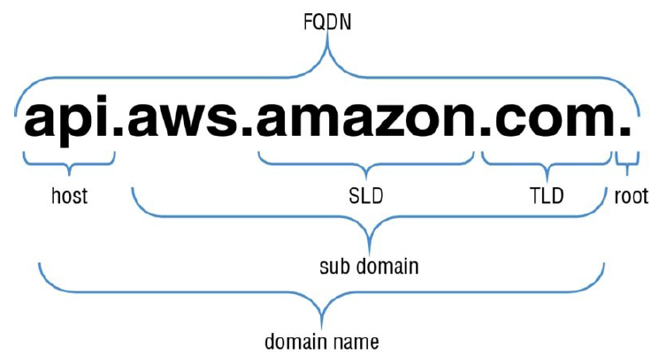

class: center, middle

## DNS

---

## First off, a lil bit of DNS general knowledge

  - A domain name is a human-friendly name associated to an IP
  - DNS uses a hierarchical structure of names separated with dots
  - A dns name will go from the most specific part to less specific 
  - TLDs - Is the rightmost part of a dns name (.com, .org, .tk)

  
  

---

## First off, a lil bit of DNS general knowledge

  - Name server - a computer designed to translate names to IPs
  - Zone files - Simple text file that contains the mapping between domain names and ip addresses
  - Normally a dns resolution will go like this (i.e. www.chefencasa.co):
    - Check if the name is saved on the hosts file
    - Check the dns cache
    - Request a name resolution from the dns servers configured on the net-IF
    - Request the TLD server responsible from all the .co domains 
    - Query the name server responsible for the chefencasa.co
    - Profit, you got directed towards the resource you wanted!
  - A zone file contains records which are just mappings between a resource and a name

---

## All about records

  - Zone files contains records which are single mappings between resources and a name
  - There are several record types:
    - SOA (Mandatory) - Identifies the base info about the domain
    - A and AAAA - maps a host to an ip
    - CNAME - defines an alias for the host
    - MX - defines mail server for a domain
    - NS - used by TLD servers to direct traffic to the server that contains the authoritative record

---

## Route 53

  - Cloud DNS service designed to give devs a cost-effective way to route end users to internet apps
  - R53 has 3 main functions:
    - Domain registration
    - DNS Service
    - Health checking
  - You can use any combination of these functions!

---

## Route 53 - Hosted Zones

  - A hosted zone is a collection of resource record sets on R53
  - Represents record sets that are managed under a single domain name
  - There are 2 types: Private (inside a vpc) and Public (routing internet traffic)
  - Protip: use alias records instead of A records (which are hardcoded ip addresses)

---

## Route 53 - Routing policies

  - Special kind of records that allow R53 to really shine (these are where the money is!)
  - Simple (default)
  - Weighted
  - Latency-based
  - Failover
  - Geolocation

---

class:center, middle 

## Route 53 - Health checking

  - Periodic domain-wide health checks of your endpoints
